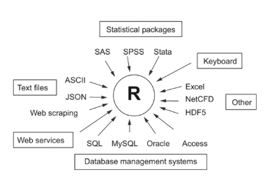
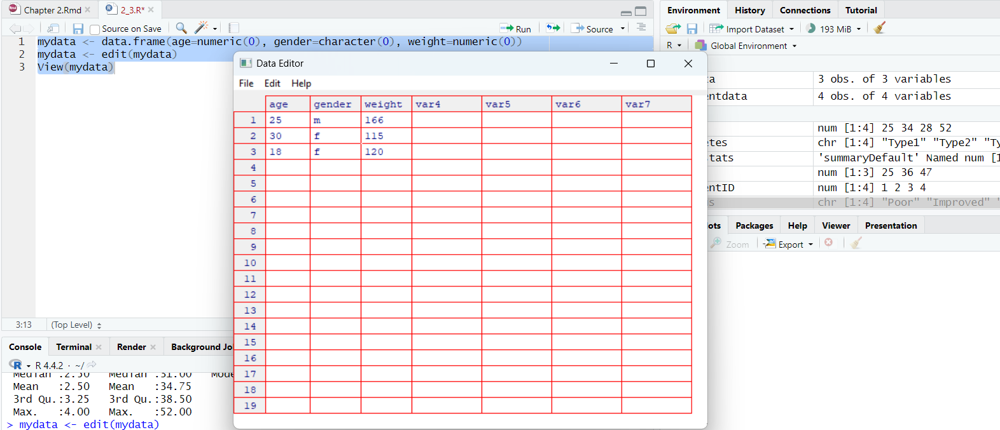

```{r setup, include = FALSE}
knitr::opts_chunk$set(echo = TRUE)
patientID <- c(1, 2, 3, 4)
age <- c(25, 34, 28, 52)
diabetes <- c("Type1", "Type2", "Type1", "Type1")
status <- c("Poor", "Improved", "Excellent", "Poor")
patientdata <- data.frame(patientID, age, diabetes, status)
```

1. A data set is usually a rectangular array of data, with rows representing 
observations and columns representing variables.

### Data Structure
#### Vector
2. A vector is one-dimensional array used to store numeric, character, or logical
data. The function **c()**, which performs the combined function, can be used to
create vectors.  
3. We can access the elements in the vector by giving the numerical value of the
element's position in square brackets.
```{r, include = TRUE}
a <- c("k", "j", "h", "a", "c", "m")
a[3]
a[c(1, 3, 5)]
a[2:6]
```
4. If we want to access multiple elements in a vector, we need to build the 
access subscript into the vector as a parameter.  

#### Matrix
5. A matrix is two-dimensional array, but every element has the same data type, 
we can create matrixes by using the function **matrix()**.
```r
mymatrix <- matrix(vector, nrow = number_of_rows, ncol = number_of_columns, 
byrow = logical_value, dimnames = list(char_vector_rownames, char_vector_columns))
```
The above parameter, *vector* includes elements of matrix, *nrow* and *ncol* used
to specify number of dimensions of rows and columns, *dimnames* includes optional
row names and column names which are character type vector. Option *byrow* indicates
the matrix should be filled by row *(byrow = TRUE)* or be filled by column *(byrow = FALSE)*,
it will be filled by column by default. The necessary properties are **nrow** and
**ncol**, if not specified, that function will create a "n×1" type matrix. If only
specify one, then it fills automatically. But if it can't fill by the specified 
number of rows or columns, e.g., 20 elements and 3 rows, then report an error.
```{r, include = TRUE}
y <- matrix(1:20, nrow = 5, ncol = 4)
y
cells <- c(1, 26, 24, 68)
rnames <- c("R1", "R2")
cnames <- c("C1", "C2")
mymatrix <- matrix(cells, nrow = 2, ncol = 2, byrow = TRUE, dimnames = list(rnames, cnames))
mymatrix
mymatrix <- matrix(cells, nrow = 2, ncol = 2, byrow = FALSE, dimnames = list(rnames, cnames))
mymatrix
```
6. We can use suffixes and brackets to choose the row, column, element of matrix.
**x[i, ]** refers to the i(th) row of matrix x, **x[, j]** refers to the j(th) 
column of matrix x, **x[i, j]** refers to element in row i and column j. When 
choose multiple rows and columns, suffixes i and j can be numeric vectors.
```{r, include = TRUE}
x <- matrix(1:10, nrow = 2)
x
x[2, ]
x[, 2]
x[1,4]
x[1, c(4, 5)]
```
7. Matrix is dual dimensional, it can only contain one data type.

#### Array
8. An Array is homogeneous with a matrix, but its number of dimension can be 
greater than 2. It can be created by function **array()**.
```r
myarray <- array(vector, dimensions, dimnames)
```
The above parameter, *vector* includes data of array, *dimensions* is a numeric 
vector, which includes the biggest value of each dimension suffix, and *dimnames*
is optional, a list contains each dimension label.
```{r, include = TRUE}
dim1 <- c("A1", "A2")
dim2 <- c("B1", "B2", "B3")
dim3 <- c("C1", "C2", "C3", "C4")
z <- array(1:24, c(2, 3, 4), dimnames = list(dim1, dim2, dim3))
z
```
9. It is the same to select elements in an array and a matrix.

#### Data Frame
10. Each column of data frame can include different data type. If citing directly
from data frame, we can't cite single element but a column vector.
```r
mydata <- data.frame(col1, col2, col3, ...)
```
Data frame is the most practical data type we will encounter.  
Here is an example of data frame.
```{r, include = TRUE}
patientID <- c(1, 2, 3, 4)
age <- c(25, 34, 28, 52)
diabetes <- c("Type1", "Type2", "Type1", "Type1")
status <- c("Poor", "Improved", "Excellent", "Poor")
patientdata <- data.frame(patientID, age, diabetes, status)
patientdata
```
11. Data type of each column must be identical, we can select a column by the 
suffix or its name.
```{r, include = TRUE}
patientdata[1:2]
patientdata[c("diabetes", "status")]
patientdata$age
```
12. The dollar sign **$** appears firstly here, it is used to select a specific
data frame's specific 
13. Function **attach()** can add the data frame to R's searching path. Function
**detach()** can drop the data frame from R's searching path. When apply attach()
to a data frame, if there are duplicate names of variables, then someone will be
masked, whenever this happens, be cautious about the masked variable. So when 
completed using any data frame, remember to remove it from current searching path
using detach().
14. Another function **with()** can do the same thing. Its syntax as below.
```r
with(data_frame_name, {clauses})
```
Then, any assignment happens in the braces will only be applicable within the 
braces.  

15. If we need to create object that exists outside the "with()" function, use 
special assignment sign **<<-**, which can save the object to global environment.
16. In data frame, case identifier or primary key can be appointed in **data.frame()**
function's **row.name** property. Remember to appoint that when creating data frame.

#### Factor
17. Variables are divided as three types: Nominal, Ordered, Continuous. The 
former two types are not numeric, so we have a function to map each value to a 
number if the variable is the former two types. There is a function **factor()**
to accomplish the task. When using it, please make sure the appointed value is phase
match with observations, because any value appears in observation but not in 
parameter will be treated as missing value.
```r
var <- factor(var, levels, labels)
```
The above parameter, var usually calls itself, levels are the assignment values, 
labels are the original values.

18. **str()**, this function provides the structure of an object.
```{r, include = TRUE}
sex <- c("Male", "Female")
sex <- factor(sex, levels = c(1, 2), labels = c("Male", "Female"))
```

#### List
19. Lists allow us to consolidate several (possibly unrelated) objects under a
single object name. Into one list, maybe there are some vectors, some matrixes, 
some data frames, even some other lists. We can use **list()** to create list.
```r
mylist <- list(object1, object2, ...)
mylist <- list(name1 = object1, name2 = object2, ...)
```
We can also name the objects like the above.

20. We can access the elements in the list by writing the its numbers or names
into double square brackets. For named ingredients, use dollar sign is okay too.
```{r, include = TRUE}
g <- "My First List"
h <- c(25, 26, 18, 39)
j <- matrix(1:10, nrow = 5)
k <- c("one", "two", "three")
mylist <- list(title = g, ages = h, j, k)
mylist
mylist[[2]]
mylist[["ages"]]
```
21. There are some key points in R language:
* The period in the object name doesn't have any special meanings, but dollar 
sign here has the same meanings as the period when in other languages.
* R doesn't provide multi-line comment or block comment feature, but we can put
the comment into clause **if(FALSE){...}**.
* When assign a value to a nonexistent element in vector, matrix, array, list, R
will automatically append this data structure to accommodate this new value.
* There is no scalar in R, the scalar appear as single element vector.
* The suffix in R begins as 1, not 0.
* Variables can not be declare, they are created when they are firstly assigned.

### Input of Data

```{r, echo = FALSE, out.width = "50%", fig.align = "center", fig.cap = "Sources of data that can be imported into R"}

```
#### Use Keyboard to Input Data
22. Function **edit()** can call a text editor to allow us input data. Its process
is: 
* Create a void data frame (or matrix), its variables' names and its data types
should be identical to the final data set.
* Call text editor for this data object, input data, save result to itself.
* Close text editor.

Function *edit()* actually operates on a copy of object, if we don't assign it 
to a target, then our modification will lose.  
Here is an example.
```r
mydata <- data.frame(age = numeric(0), gender = character(0), weight = numeric(0))
mydata <- edit(mydata)
```
Actually, the clause will call up a text editor as below.

```{r, echo = FALSE, out.width = "90%", fig.align = "center", fig.cap = "Input data through keyboard"}

```
23. Clause **mydata <- edit(mydata)** has an equivalent way of writing **fix(mydata)**.
24. In R, in terms of property assignment, use euqal sign **=**, logical keywords
are all capital, **TRUE**, **FALSE**.

#### Import Data from Comma Seperated Value
25. Function **read.table()** can import data from **.csv** file.
```r
mydata <- read.table(file, options)
```
The above parameter, *file* is the file path, *options* are some properties we can
assign some value to. Here are some common options.
```{r table-knit-1, echo = FALSE}
library(knitr)
library(kableExtra)
library(magrittr)
data <- data.frame(
  options = c("header", "sep", "row.names", "col.names", "na.strings", "colClasses", "text"),
  descriptions = c(
    "A logical variable that indicates whether the file contains the variable name in the first line.",
    "A delimiter to separate values. Default `sep = \"\"` means one or more spaces, tabs, or line breaks. For CSV files, use `sep = \",\"`.",
    "An optional parameter that specifies one or more row markers.",
    "If `header = FALSE`, we can specify variable names via `col.names`. Otherwise, default names are V1, V2, etc.",
    "A character vector for missing values, e.g., `na.strings = c(\"-9\", \"?\")` converts `-9` and `?` to `NA`.",
    "Optionally set column classes, e.g., `colClasses = c(\"numeric\", \"numeric\", \"character\", \"NULL\", \"numeric\")`.",
    "A string specifying the text to be processed. If `text` is set, `file` should be left blank."
  )
)
kable(data, caption = "Options for function read.table()") %>% 
  kable_styling(bootstrap_options = c("striped", "hover", "condensed", "bordered"), 
                full_width = FALSE) %>% 
    column_spec(1:2, width = "10cm", latex_column_spec = "c")
```
In some cases, when reading CSV file, we should use double quotes **"** to quote
the special content, or the delimiter will be erroneously read as others but not comma.

#### Import Excel Data
26. The most practical way to import a **.xlsx** file is to transform it to **.csv**
file and then import. Additionally, we can use function **read.xlsx()** to import it.
It should be noticed that we should install **xlsx** package before using it, and 
it also has some dependecies packages, **xlsxjars** and **rJava**, and an appropriate
working Java environment [here](http://java.com). *xlsx* package can read Excel 97/
2000/XP/2003/2007 file.
```r
library(xlsx)
workbook <- "C:/myworkbook.xlsx"
mydataframe <- read.xlsx(workbook, 1)
```
The simplest way to use the function is **read.xlsx(file, n)**. *file* is the file 
path, *n* is the sheet number we want to import. If the workbook is too large to
be processed, use the function **read.xlsx2()**, which will use Java to process.

#### Import XML Data
27. R has some packages to process **.xml** file. For instance, the package written
by Duncan Temple Lang allow us to read, write, operate *xml* file. If interested,
this website could help, [click here to look up](www.omegahat.org/RSXML)(www.omegahat.org/RSXML).

#### Import Web Data
28. The data on web gathering, namely, webscraping. For basic web scraping tasks
the **readLines()** function will usually suffice. *readLines()* allows simple 
access to webpage source data on non-secure servers. In its simplest form, readLines() takes a single argument – the URL of the web page to be read.
```r
# R read webpage
web_page <- readLines("http://www.interestingwebsite.com")
```
One note, by itself *readLines()* can only acquire the data. We will need to use
**grep()**, **gsub()** or equivalents to parse the data and keep what we need.

29. To get more advanced **http** features such as POST capabilities and **https**
access, we’ll need to use the **RCurl** package. To do web scraping tasks with 
the RCurl package use the **getURL()** function. After the data has been acquired
via *getURL()*, it needs to be restructured and parsed. The **htmlTreeParse()** 
function from the XML package is tailored for just this task. Using *getURL()*
we can access a secure site.  
Here is an example.
```r
library(RCurl)
library(XML)
jan09 <- getURL("https://stat.ethz.ch/pipermail/r-help/2009-January/date.html", ssl.verifypeer = FALSE)
jan09_parsed <- htmlTreeParse(jan09)
```
If interested, look up [*Web Technologies and Services*](https://cran.r-project.org/web/views/WebTechnologies.html)

#### Import SPSS Data
30. IBM SPSS data set can use **read.spss()** function from package **foreign** 
to import. Alternatively, we can also use **spss.get()** function from package 
**Hmisc** to import. Thereinto, *Hmisc* should be installed before using. Here 
is an example.
```r
library(Hmisc)
mydataframe <- spss.get("mydata.sav", use.value.labels = TRUE)
```

#### Import Stata Data
31. It is simple, here is an example. The below parameter, *mydata.dta* is Stata
data set, *mydataframe* is a data frame returned by R.
```r
library(foreign)
mydataframe <- read.dta("mydata.dta")
```

#### Import SAS Data
Beyond the scope of discussion.

#### Import NetCDF Data
Beyond the scope of discussion.

#### Import HDF5 Data
Beyond the scope of discussion.

#### Access the Database Management System
Refer to <*http://cran.r-project.org*>

#### Import Data through Stat/Transfer
This is a business software [Stat/Transfer](www.stattransfer.com), which can 
transform the data types among 34 different. It has **Windows, Mac, Unix** edition, 
support many statistical softwares. It can visit many database management system
like **Microsoft SQL Server, Microsoft Access, MySQL, Oracle, PostgreSQL, DB2, Sybase, Teradata, SQLite, Informix, etc.**

### Annotation of the Data Set
To make the results easier to interpret, data analysts often annotate the data set. This includes adding descriptive labels to variable names and value labels to encodings in categorical variables.

#### Variable Label
32. It is pity that R has limit power on processing variable labels. One solution is
to put labels as names, use suffix to visit this variable. Function **names()** 
can do this.
```r
names(object)
```
The above parameter, object is a data frame. The function will return a vector 
contains the variable names, we can select the names to modify. Here is an example.
Take the former patient data.
```{r, include = TRUE}
names(patientdata)[2] <- "Age at hospitalization (in years)"
names(patientdata)[2]
patientdata
```

#### Value Label
33. Function **factor()** can create value labels for categorical variable. Also
use former example, imagine that we have a variable named *gender*, thereinto, *1*
represents male, *2* represents female.
```{r, include = TRUE}
patientdata$gender <- c("1", "2", "1", "2")
patientdata$gender <- factor(patientdata$gender, levels = c(1, 2), labels = c("Male", "Female"))
patientdata$gender
str(patientdata$gender)
summary(patientdata$gender)
```
The above parameter, *levels* represents exact variable value, *lebels* represents
character vector contains ideal labels.

### Utility Functions that Handle Data Objects
```{r table-knit-2, echo = FALSE}
library(knitr)
library(kableExtra)
library(magrittr)
data <- data.frame(
  functions = c("length(object)", "dim(object)", "str(object)", "class(object)", "mode(object)", "names(object)", "cbind(object)", "rbind(object)", "head(object)", "tail(object)", "ls()", "rm(object, object, ...)", "newobject <- edit(object)"),
  descriptions = c(
    "Displays the number of elements/components in the object.",
    "Displays the dimensions of the object.",
    "Displays the structure of the object.",
    "Displays the class or type of the object.",
    "Displays the mode of the object.",
    "Displays the names of the components in the object.",
    "Merge objects by column.",
    "Merge objects by row.",
    "Lists the beginning of the object.",
    "Lists the last part of the object.",
    "Displays the current object list, no parameter needed.",
    "Delete one or more objects, clause `rm(list = ls())` will delete almost all
    the objects in current environment except hidden objects that start with a period.",
    "Edits the object and save as newobject."
  )
)
kable(data, caption = "Utility functions that handle data objects") %>% 
  kable_styling(bootstrap_options = c("striped", "hover", "condensed", "bordered"), 
                full_width = FALSE) %>% 
    column_spec(1:2, width = "10cm", latex_column_spec = "c")
```
*head()* and *tail()* will return the first six and last six rows of data respectively.