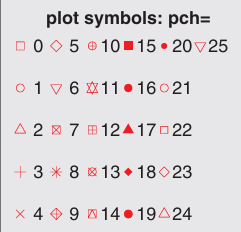
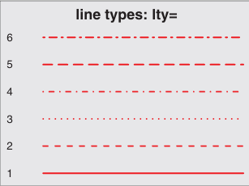

```{r setup, include = FALSE}
knitr::opts_chunk$set(echo = TRUE)
dose <- c(20, 30, 40, 45, 60)
drugA <- c(16, 20, 27, 40, 60)
drugB <- c(15, 18, 25, 31, 40)
```

### Use Graph
1. We can save graphics through code or graphical user interface. To save 
graphics through code, place drawing statements between statements that open the
target graphics device and statements that close the target graphics device. Here
is an example.
```r
pdf("3_1.pdf")
  attach(mtcars)
  plot(wt, mpg)
  abline(lm(mpg~wt))
  title("Regression of MPG on Weight")
  detach(mtcars)
dev.off()
```
2. Function **x11()** without any parameter can be used to create a new graphic
window.
3. Only one device is the ‘active’ device: this is the device in which all 
graphics operations occur. There is a *null device* which is always open but is
really a placeholder. Devices are associated with a name (e.g., "X11" or "postscript")
and a number in the range 1 to 63. The null device is always device 1. Once a 
device has been opened the null device is not considered as a possible active 
device. There is a list of open devices, and this is considered as a circular 
list not including the null device. **dev.next()** and **dev.prev()** select the
next open device in the appropriate direction, unless no device is open. **dev.off()**
shuts down the specified (by default the current) device. If the current device 
is shut down and any other devices are open, the next open device is made current.
It is an error to attempt to shut down device 1. **graphics.off()** shuts down 
all open graphics devices. Normal termination of a session runs the internal 
equivalent of graphics.off(). **dev.set()** makes the specified device the 
active device. If there is no device with that number, it is equivalent to *dev.next()*.
If which = 1 it opens a new device and selects that. **dev.list()** returns the 
numbers of all open devices, except device 1, the null device. This is a numeric
vector with a names attribute giving the device names, or NULL is there is no
open device.
Here is an example.
```r
x11()
plot(1:10)
x11()
plot(rnorm(10))
dev.set(dev.prev())
abline(0, 1)
dev.set(dev.next())
abline(h = 0, col = "gray")
dev.set(dev.prev())
dev.off(); dev.off()
```
### A Simple Example
```{r table-knit-1, echo = FALSE}
library(knitr)
library(kableExtra)
library(magrittr)
data <- data.frame(
  dose = c(20, 30, 40, 45, 60),
  response_to_drugA = c(16, 20, 27, 40, 60),
  response_to_drugB = c(15, 18, 25, 31, 40)
)
kable(data, caption = "Patients' responses to five dose levels of two drugs") %>% 
  kable_styling(bootstrap_options = c("striped", "hover", "condensed", "bordered"), 
                full_width = FALSE) %>% 
    column_spec(1:3, width = "5cm", latex_column_spec = "c")
```
Use the codes below to import the data.
```r
dose <- c(20, 30, 40, 45, 60)
drugA <- c(16, 20, 27, 40, 60)
drugB <- c(15, 18, 25, 31, 40)
```
Use the codes below to create a graph describing correlation between dose of drugA
and responses.
```{r, include = TRUE, fig.align = "center"}
plot(dose, drugA, type = "b")
```

4. **plot()** is a generic function in R that plots objects. Here, *plot(x, y, type = "b")*
puts x in horizontal axis and y in vertical axis, paint point set (x, y), then link
them with lines. Option *type = "b"* indicates painting points and lines. What's
more, *"p"* for points, *"l"* for lines, *"c"* for empty points joined by lines, 
*"o"* for overplotted points and lines, *"s"* for stair steps and *"h"* for histogram-like
vertical lines, *"n"* for not produce any points or lines. We may talk about other
attributes later.

### Graphics Parameters
We can customize many features of a graph by modifying options called graph
parameters(font, color, axis, label). One way to do this is to specify these 
options via the function **par()**. Parameter values set in this way will remain
in effect until the session ends unless they are modified again. Its syntax is 
**par(optionname = value, optionname = value, ...)** . Call *par()* without 
parameter will generate a list contains current graphic parameter settings. Add
parameter **no.readonly = TRUE** can create a modifiable current graphic parameter
settings list.  
Here is an example.
```{r, include = TRUE, fig.align = "center"}
opar <- par(no.readonly = TRUE)
par(lty = 2, pch = 17) # Equal to par(lty = 2); par(pch = 17)
plot(dose, drugA, type = "b")
par(opar)
```
The first statement above copies the current graphics parameter settings. The 
second statement changes the default line type to a dashed line and the default 
point symbol to a solid triangle. Finally, we draw the graph and restore the
original settings.  
Another way to set graphic parameters is to provide key-value pairs 
*optionname = value* directly to senior graphic functions. But this way only 
take effect in this graph, and not all parameters are available for all specific
senior graphic functions.  
Now, we are going to talk about many graphic parameters.

#### Symbols and Lines
Here are some parameters showed below.
```{r, table-knit-2, echo = FALSE}
library(knitr)
library(kableExtra)
library(magrittr)
data <- data.frame(
  parameter = c("pch", "cex", "lty", "lwd"),
  description = c("Specifies the symbol to use when plotting points.",
                  "Specifies the symbol size. `cex` is a number indicating the amount by which plotting symbols should be scaled relative to the default.(default = 1)",
                  "Specifies the line type.",
                  "Specifies the line width. `lwd` is expressed relative to the default. (default = 1)")
)
kable(data, caption = "Parameters for specifying symbol and line type") %>% 
  kable_styling(bootstrap_options = c("striped", "hover", "condensed", "bordered"), 
                full_width = FALSE) %>% 
    column_spec(1, width = "3cm", latex_column_spec = "c") %>% 
    column_spec(2, width = "10cm", latex_column_spec = "c")
```
Option *pch = * is used to specify the symbols when printing points, belows are
some possible values.

```{r, echo = FALSE, out.width = "35%", fig.align = "center", fig.cap = "Plotting symbols specified with the pch parameter"}

```
For symbols 21~25, we can also specify the border color(col = ) and fill color(bg = ).  
The option *lty = * can be used to specify the wanted line type.
```{r, echo = FALSE, out.width = "35%", fig.align = "center", fig.cap = "Line types specified with the lty parameter"}

```
Here is an example.
```{r, include = TRUE, fig.align = "center", fig.cap = "Modify line type, line width, point symbol, symbol size"}
plot(dose, drugA, type = "b", lty = 3, lwd = 3, pch = 15, cex = 2)
```
#### Color
Here are some parameters showed below.
```{r, table-knit-3, echo = FALSE}
library(knitr)
library(kableExtra)
library(magrittr)
data <- data.frame(
  parameter = c("col", "col.axis", "col.lab", "col.main", "col.sub", "fg", "bg"),
  description = c("The default painting color, some functions can accept a vector contains color values to use circularly.",
                  "The color of the axis tick text.",
                  "The color of the axis label.",
                  "The color of the title.",
                  "The color of the subtitle.",
                  "Foreground color of the graphic.",
                  "Background color of the graphic.")
)
kable(data, caption = "Parameters for specifying color") %>% 
  kable_styling(bootstrap_options = c("striped", "hover", "condensed", "bordered"), 
                full_width = FALSE) %>% 
    column_spec(1, width = "3cm", latex_column_spec = "c") %>% 
    column_spec(2, width = "10cm", latex_column_spec = "c")
```
5. In R, we can specify color using color suffix, color name, hexadecimal color 
value, RGB value, HSV value, e.g., `col = 1`, `col = "white"`, `col = #FFFFFF`, 
`col = rgb(1, 1, 1)`, `col = hsv(0, 0, 1)`, these are all specify white. The *rgb()* function generates colors based on the red-green-blue values, while the *hsv()* function generates colors based on the hue-saturation-brightness values.
6. Function **colors()** will return all available color names. And there are many 
functions in R can create continuous color vectors, including **rainbow(), heat.colors(), terrain.colors(), topo.colors(), cm.colors()**. For example, *rainbow(10)* can generate 
ten continuous rainbow type colors.
7. Multi-level grayscale colors can be generated using the **gray()** function that 
comes with the basic installation. In this case, a vector with element values
between 0 and 1 is used to specify the grayscale of each color. *gray(0 : 10 / 10)* 
will generate 10-level grayscale. Here is an example.
```{r, include = TRUE, fig.align = "center"}
n <- 10
mycolors <- rainbow(10)
pie(rep(1, n), labels = mycolors, col = mycolors)
mygrays <- gray(0 : n / n)
pie(rep(1, n), labels = mygrays, col = mygrays)
```

#### Text Properties
Graphic parameters can also specify font size, font, typeface.
```{r, table-knit-4, echo = FALSE}
library(knitr)
library(kableExtra)
library(magrittr)
data <- data.frame(
  parameter = c("cex", "cex.axis", "cex.lab", "cex.main", "cex.sub"),
  description = c("Indicates the value of the zoom factor relative to the default size, the default size is one",
                  "The value of the zoom factor about axis tick text.",
                  "The value of the zoom factor about axis label.",
                  "The value of the zoom factor about title.",
                  "The value of the zoom factor about subtitle.")
)
kable(data, caption = "Parameters for specifying text size") %>% 
  kable_styling(bootstrap_options = c("striped", "hover", "condensed", "bordered"), 
                full_width = FALSE) %>% 
    column_spec(1, width = "3cm", latex_column_spec = "c") %>% 
    column_spec(2, width = "10cm", latex_column_spec = "c")
```
```{r, table-knit-5, echo = FALSE}
library(knitr)
library(kableExtra)
library(magrittr)
data <- data.frame(
  parameter = c("font", "font.axis", "font.lab", "font.main", "font.sub", "ps", "family"),
  description = c("Integer. Used to specify the font style for painting. `1 = regular`, `2 = bold`, `3 = italics`, `4 = bold italics`, `5 = symbol font`(impress as Adobe symbol coding)", 
                  "The font style of axis tick text.",
                  "The font style of axis label.",
                  "The font style of title.",
                  "The font style of subtitle.",
                  "Font point size, the actual size of text is `ps*cex`.",
                  "The font family to use when drawing text.`serif` for serif, `sans` for sans serif, `mono` for fixed width.")
)
kable(data, caption = "Parameters for specifying font family, font size, font style") %>% 
  kable_styling(bootstrap_options = c("striped", "hover", "condensed", "bordered"), 
                full_width = FALSE) %>% 
    column_spec(1, width = "3cm", latex_column_spec = "c") %>% 
    column_spec(2, width = "10cm", latex_column_spec = "c")
```
8. We can set the font size and font style readily, but for font family, something
different. We have three font styles but map to *True Type Times New Roman*, *True Type Arial*, *True Type Courier New*, respectively. Except that three values, we can 
also use function **windowsFont()** to create this map in Windows. Here is an example.
```r
windowsFonts(
  A = windowsFont("Arial Black"),
  B = windowsFont("Bookman Old Style"),
  C = windowsFont("Comic Sans MS")
)
```
After run this clause, we can use parameter like: *par(family = "A")*. It should 
be noted that, in Mac, we should use the function **quartzFonts()** instead.

#### Graphics Size and Border Size
```{r, table-knit-6, echo = FALSE}
library(knitr)
library(kableExtra)
library(magrittr)
data <- data.frame(
  parameter = c("pin", "mai", "mar"),
  description = c("Graphic size in inches.(width and height as numeric vector)", 
                  "The border size represented by a numeric vector in the order bottom, left, top, right, in inches(1 inch = 2.54 cm)",
                  "The border size represented by a numeric vector in the order bottom, left, top, right, in lines. By default(c(5, 4, 4, 2) + 0.1)")
)
kable(data, caption = "Parameters for specifying graphics size and border size") %>% 
  kable_styling(bootstrap_options = c("striped", "hover", "condensed", "bordered"), 
                full_width = FALSE) %>% 
    column_spec(1, width = "3cm", latex_column_spec = "c") %>% 
    column_spec(2, width = "10cm", latex_column_spec = "c")
```
```r
par(pin = c(4, 3), mai = c(1, .5, 1, .2))
```
The above code create graphs that are 4 inches wide by 3 inches tall, with a 1-inch 
margin on the bottom and top, a 0.5-inch margin on the left, and a 0.2-inch margin
on the right.  
For general review, here is an example.
```{r, include = TRUE, fig.align = "center"}
# Copy currrent parameter settings
opar <- par(no.readonly = TRUE)
# Set the size of graphs to 2 inches wide by 3 inches tall
par(pin = c(2, 3))
# Set the line width double than the default and symbol size 1.5 times to the default
par(lwd = 2, cex = 1.5)
# Set the axis tick text size 75% to the default and its font style is italics
par(cex.axis = .75, font.axis = 3)
# In graph 1, set the point type as 19 and line type as 2, color is red
plot(dose, drugA, type = "b", pch = 19, lty = 2, col = "red")
# In graph 2, set the point type as 23 and line type as 6, point background color as green, line and point border color are blue
plot(dose, drugB, type = "b", pch = 23, lty = 6, col = "blue", bg = "green")
# Restore default settings
par(opar)
```

### Add Text, Customize Axes and Legends
