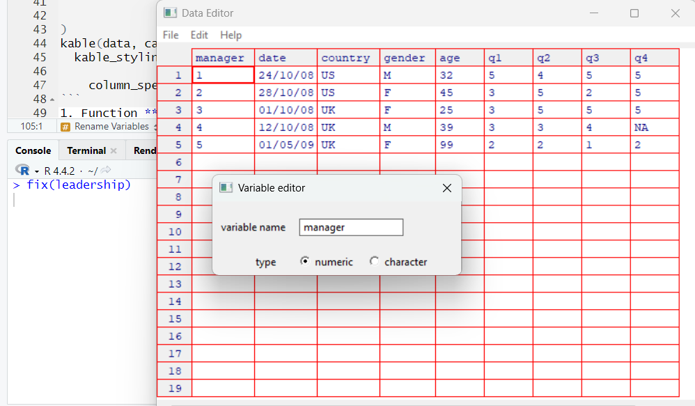

```{r setup, include=FALSE}
knitr::opts_chunk$set(echo = TRUE)
manager <- c(1, 2, 3, 4, 5)
date <- c("24/10/08", "28/10/08", "01/10/08", "12/10/08", "01/05/09")
country <- c("US", "US", "UK", "UK", "UK")
gender <- c("M", "F", "F", "M", "F")
age <- c(32, 45, 25, 39, 99)
q1 <- c(5, 3, 3, 3, 2)
q2 <- c(4, 5, 5, 3, 2)
q3 <- c(5, 2, 5, 4, 1)
q4 <- c(5, 5, 5, NA, 2)
q5 <- c(5, 5, 2, NA, 1)
leadership <- data.frame(manager, date, country, gender, age, q1, q2, q3, q4, q5,
                         stringsAsFactors = FALSE)
```

### Create New Variables
We always create new variables through this syntax.
```r
variable_name <- expression
```
The composition above, *expression* can involve many operators and functions, 
here are some arithmetic operators that can form formulas.
```{r table-knit-1, echo = FALSE}
library(knitr)
library(kableExtra)
library(magrittr)
data <- data.frame(
  operator = c("\\+", "\\-", "\\*", "/", "^ or **", "x %% y", "x %/% y"),
  description = c("Add",
                  "Subtract",
                  "Multiply",
                  "Divide",
                  "Exponentiation",
                  "Complementation(x mod y), 5 %% 2 = 1",
                  "Integer Division, 5 %/% 2 = 2")
)
kable(data, caption = "Arithmetic operators") %>% 
  kable_styling(bootstrap_options = c("striped", "hover", "condensed", "bordered"), 
                full_width = FALSE) %>% 
    column_spec(1:2, width = "5cm", latex_column_spec = "c")
```
1. Function **transform()** can do anything useful with data frames currently. Here
is an example, we use this function to add two variables to data frame mydata.
```{r, include = TRUE}
mydata <- data.frame(x1 = c(2, 2, 6, 4), x2 = c(3, 4, 2, 8))
mydata <- transform(mydata, sumx = x1 + x2, meanx = (x1 + x2) / 2)
mydata
```
### Reencoding of Variables
If we want to encode a variable, we may use the logical operator.
```{r table-knit-2, echo = FALSE}
library(knitr)
library(kableExtra)
library(magrittr)
data <- data.frame(
  operator = c("<", "<=", ">", ">=", "==", "!=", "!x", "x | y", "x & y", "isTRUE(x)"),
  description = c("Less than",
                  "Less than or equal to",
                  "Greater than",
                  "Greater than or equal to",
                  "Exactly equal to",
                  "Not equal to",
                  "Not x",
                  "x or y",
                  "x and y",
                  "Test if x is TRUE")
)
kable(data, caption = "Logical operators", escape = FALSE, format = "html") %>% 
  kable_styling(bootstrap_options = c("striped", "hover", "condensed", "bordered"), 
                full_width = FALSE) %>% 
    column_spec(1:2, width = "5cm", latex_column_spec = "c")
```
2. Clause **variable[condition] <- expression** will only assign value to the 
variable when *condition* is *TRUE*.
```{r, include = TRUE}
# If we have a data frame including a vector named age in it
head(leadership$age)
# age 99 is a NA value
# We want to encode the age to categorical variable
leadership$age[leadership$age == 99] <- NA
leadership <- within(leadership, {
                    agecat <- NA
                    agecat[age > 75] <- "Elder"
                    agecat[age >= 55 & age <= 75] <- "Middle Aged"
                    agecat[age < 55] <- "Young"})
head(leadership$agecat)
```
3. Funciton **within()** resembles function **with()**, but it can modify the data
frame.
4. `NA` is a keyword in R.
### Rename Variables
5. We can use interactive window to change a variable name using function **fix()**.
This function always takes effect on a data frame.
```r
fix(leadership)
```
The above clause will enable a pop-up window, in which we can modify variable names.
```{r, echo = FALSE, out.width = "80%", fig.align = "center", fig.cap = "Pop-up window to modify variable names"}

```
6. Alternatively, we can modify variable names via coding using function **names()**.
This function has been introduced former. Here is an example.
```{r, include = TRUE}
names(leadership)
names(leadership)[2] <- "testDate"
names(leadership)[6 : 10] <- c("item1", "item2", "item3", "item4", "item5")
head(leadership)
```
7. In package **plyr**, we have a function **rename()** to do that, the format 
is as belows.
```r
rename(dataframe, c(oldname = "newname", oldname = "newname", ...))
```
Here is an example.
```{r, include = TRUE}
library(plyr)
leadership <- rename(leadership, c(manager = "managerID", testDate = "date"))
tail(leadership)
```
8. Package *plyr* has a series of dataset operation functions, we can look for it
on <*http://had.co.nz/plyr*>.

### Missing Value
9. There are some functions in R can help us probe the NA values **is.na()**. This 
function will return a corresponding binary dimensions matrix to specify if the 
elements are NA. Here is an example.
```{r, include = TRUE}
y <- c(1, 2, 3, NA)
is.na(y)
is.na(leadership[, 6 : 10])
```
10. There are two keys to be remember: Firstly, the NA value can not be compare, even 
compare itself, that means `myvar == NA` will never be *TRUE*. Secondly, R will 
not label the infinite values or impossible values to NA. For instance, the clause
`5 / 0` returns *Inf* but not *NA*, `sin(Inf)` returns *NAN* means not a number, but 
not *NA*. Only the missing value can be *NA*. We can use **is.infinite()** or 
**is.nan()** to handle these cases.
11. Please ensure before any analysis, we have labeled the missing values to NA.
12. Be careful when dealing with the missing values, if a function has some missing
values as its input, then its output will also be missing value. Fortunately, every
multiple input function has a property can eliminate the missing values `na.rm = TRUE`.
Here is an example.
```{r, include = TRUE}
x <- c(1, 2, NA, 3)
y1 <- x[1] + x[2] + x[3] + x[4]
y1
z1 <- sum(x)
z1
z2 <- sum(x, na.rm = TRUE)
z2
```
13. In addition, function **na.omit()** can omit every row has missing values. 
Here is an example.
```{r, include = TRUE}
head(leadership)
newdata <- na.omit(leadership)
head(newdata)
```
Delete all the observations having missing values can be a method when dealing 
with some of the cases, but it is just a junior strategy, we will discuss some
senior strategies later.

### Date Value
