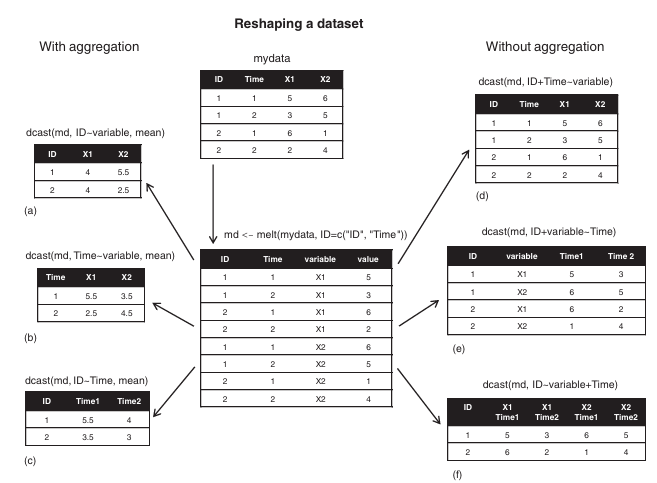

```{r setup, include = FALSE}
knitr::opts_chunk$set(echo = TRUE)
name <- c("John Davis", "Angela Williams", "Bullwinkle Moose", "David Jones", "Janice Markhammer", "Cheryl Cushing", "Reuven Ytzrhak", "Greg Knox", "Joel England", "Mary Rayburn")
math <- c(502, 600, 412, 358, 495, 512, 410, 625, 573, 522)
science <- c(95, 99, 80, 82, 75, 85, 80, 95, 89, 86)
English <- c(25, 22, 18, 15, 20, 28, 15, 30, 27, 18)
```
Here is an example we will use throughout the chapter.
```{r table-knit-1, echo = FALSE}
library(knitr)
library(kableExtra)
library(magrittr)
data <- data.frame(
  name = c("John Davis", "Angela Williams", "Bullwinkle Moose", "David Jones",           "Janice Markhammer", "Cheryl Cushing", "Reuven Ytzrhak", "Greg Knox", "Joel England",    "Mary Rayburn"),
  math = c(502, 600, 412, 358, 495, 512, 410, 625, 573, 522),
  science = c(95, 99, 80, 82, 75, 85, 80, 95, 89, 86),
  English = c(25, 22, 18, 15, 20, 28, 15, 30, 27, 18)
)
kable(data, caption = "Student grade data") %>% 
  kable_styling(bootstrap_options = c("striped", "hover", "condensed", "bordered"), 
                full_width = FALSE) %>% 
    column_spec(1, width = "10cm", latex_column_spec = "c") %>% 
    column_spec(2 : 4, width = "5cm", latex_column_spec = "c")
```
### Numerical and Character Functions
#### Mathematical Functions
```{r table-knit-2, echo = FALSE}
library(knitr)
library(kableExtra)
library(magrittr)
data <- data.frame(
  functions = c("abs(x)", "sqrt(x)", "ceiling(x)", "floor(x)", "trunc(x)", "round(x, digits = n", "signif(x, digits = n)", "cos(x), sin(x), tan(x)", "acos(x), asin(x), atan(x)", "cosh(x), sinh(x), tanh(x)", "acosh(x), asinh(x), atanh(x)", "log(x, base = n)", "log(x)", "log10(x)", "exp(x)"),
  description = c("Absolute value, abs(-4) returns 4",
                  "Square root, sqrt(25) returns 5",
                  "The smallest integer not less than x, ceiling(3.475) returns 4",
                  "The largest integer not greater than than x, floor(3.475) returns 3",
                  "Truncate the integer part towards the direction of 0, trunc(5.99) returns 5",
                  "Round x to a decimal of the specified place, round(3.475, digits = 2) returns 3.48",
                  "Rounds x to the specified number of significant digits, signif(3.475, digits = 2) returns 3.5",
                  "Cosine, sine, and tangent, cos(2) returns -0.416",
                  "Arccosine, arcsine, and arctangent, acos(-0.416) returns 2",
                  "Hyperbolic cosine, hyperbolic sine, hyperbolic tangent, sinh(2) returns 3.627",
                  "Inverse hyperbolic cosine, inverse hyperbolic sine, inverse hyperbolic tangent, asinh(3.627) returns 2",
                  "Take the base n logarithm of x",
                  "Natural logarithm of x, log(10) returns 2.3026",
                  "Common logarithm of x, log10(10) returns 1",
                  "Exponential function, exp(2.3026) returns 10")
)
kable(data, caption = "Mathematical functions") %>% 
  kable_styling(bootstrap_options = c("striped", "hover", "condensed", "bordered"), 
                full_width = FALSE) %>% 
    column_spec(1 : 2, width = "10cm", latex_column_spec = "c")
```
The above mathematical functions take the scalar as inputs, then output a scalar.
They can also take vector as inputs, e.g., sqrt(c(4, 16, 25)) returns c(2, 4, 5).

#### Statistical Functions
Many statistical functions have optional parameters. Here is an example.
```r
# Return arithmetic mean
y <- mean(x)
# Return arithmetic mean with some operation
# Drop the highest and lowest 5% data and any missing values
z <- mean(x, trim = 0.05, na.rm = TRUE)
```
```{r table-knit-3, echo = FALSE}
library(knitr)
library(kableExtra)
library(magrittr)
data <- data.frame(
  functions = c("mean(x)", "median(x)", "sd(x)", "var(x)", "mad(x)", "quantile(x, probs)", "range(x)", "sum(x)", "diff(x, lag = n)", "min(x)", "max(x)", "scale(x, center = TRUE, scale = TRUE)"),
  description = c("Mean. e.g., mean(c(1, 2, 3, 4)) returns 2.5",
                  "Median. e.g., median(c(1, 2, 3, 4)) returns 2.5",
                  "Standard Deviation. e.g., sd(c(1, 2, 3, 4)) returns 1.29",
                  "Variance. e.g., var(c(1, 2, 3, 4)) returns 1.67",
                  "Median absolute deviation. e.g., mad(c(1, 2, 3, 4)) returns 1.48",
                  "Quantile. The x is a numeric vector waiting for quantile, probs is a numeric vector formed by a probability between 0 and 1. e.g., # Calculate the 30% and 84% quantile of x, y <- quantile(x, c(.3, .84))",
                  "Calculate Range. e.g., x <- c(1, 2, 3, 4), range(x) returns c(1, 4)",
                  "Sum. e.g., sum(c(1, 2, 3, 4)) returns 10",
                  "Delayed differential, lag specifies how many items delay, by default it is 1. e.g., x <- c(1, 5, 23, 29), diff(x) returns c(4, 18, 6)",
                  "Minimum. e.g., min(c(1, 2, 3, 4)) returns 1",
                  "Maximum. e.g., max(c(1, 2, 3, 4)) returns 4",
                  "Centralize the x by columns(center = TRUE), standardize the x(center = TRUE, scale = TRUE)")
)
kable(data, caption = "Statistical functions", escape = FALSE) %>% 
  kable_styling(bootstrap_options = c("striped", "hover", "condensed", "bordered"), 
                full_width = FALSE) %>% 
    column_spec(1 : 2, width = "10cm", latex_column_spec = "c")
```
Here is an example.
```{r, include = TRUE}
x <- c(1, 2, 3, 4, 5, 6, 7, 8)
mean(x)
sd(x)
n <- length(x)
meanx <- sum(x) / n
css <- sum((x - mean(x)) ^ 2)
sdx <- sqrt(css / (n - 1))
meanx
sdx
```
Writing formulas in R has much in common with matrix-manipulation languages such as MATLAB.

1. Note that, the standard deviation here is sample standard deviation instead of
population standard deviation. The function *sd(x)* also calculate the sample 
standard deviation.
2. Function *scale()* standardize the specified column of a matrix or data frame
to a mean of 0 and a standard deviation of 1. `newdata <- scale(mydata)` To standardize
a column to an arbitrary mean and standard deviation, we can use some methods. 
`newdata <- scale(mydata) * SD + M` Where M is mean, SD is standard deviation. Using 
*scale()* on non-numeric columns will return error. If we want to use the function
to specified columns instead of all columns, we can do it by the following code.
`newdata <- transform(mydata, myvar = scale(myvar) * 10 + 50)`

#### Probability Functions
3. Probability functions are usually used to generate simulated data with known
characteristics and to calculate probability values within user-written statistical 
functions. In R, the probability functions have the prototype as follows.
```r
[dpqr]distribution_abbreviation()
```
The prefix in the function name has specific meanings.

* d: Density function
* p: Distribution function
* q: Quantile function
* r: Random value generation function

For instance, dnorm means normal distribution density function.
```{r table-knit-4, echo = FALSE}
library(knitr)
library(kableExtra)
library(magrittr)
data <- data.frame(
  distribution_name1 = c("Beta distribution", "Binominal distribution", "Cauchy distribution", "Non-centered chisquare distribution", "Exponential distribution", "F distribution", "Gamma distribution", "Geometry distribution", "Hypergeometric distribution", "Lognormal distribution"),
  abbreviation1 = c("beta", "binom", "cauchy", "chisq", "exp", "f", "gamma", "geom", "hyper", "lnorm"),
  distribution_name2 = c("Logistic distribution", "Multinominal distribution", "Negative binominal distribution", "Normal distribution", "Poisson distribution", "Wilcoxon sign rank distribution", "T distribution", "Uniform distribution", "Weibull distribution", "Wilcoxon rank sum distribution"),
  abbreviation2 = c("logis", "multinom", "nbinom", "norm", "pois", "signrank", "t", "unif", "weibull", "wilcox")
)
kable(data, caption = "Probability functions") %>% 
  kable_styling(bootstrap_options = c("striped", "hover", "condensed", "bordered"), 
                full_width = FALSE) %>% 
    column_spec(1 : 4, width = "5cm", latex_column_spec = "c")
```
Here is an example.
```{r, include = TRUE, fig.align = "center"}
# We want to draw the standard normal distribution density line on range [-3, 3]
# Function pretty just like the function linspace in MATLAB but slightly different
x <- pretty(c(-3, 3), 30)
# Calculate the density at the points in vector x
y <- dnorm(x)
# Make the graph
plot(x, y, type = "l", xlab = "Normal deviate", ylab = "Density", yaxs = "i")
# Calculate the cumulative distribution probability value on the parameter
pnorm(1.96)
# Calculate the quantile value at the probability point
qnorm(.9, mean = 500, sd = 100)
# Generate 50 normal random value whose mean is 50, standard deviation is 10
rnorm(50, mean = 50, sd = 10)
```
Here are some introductions about these functions. The below description are set
to describe the normal distribution.
$$f(x) = \frac{1}{\sigma \sqrt{2\pi}} e^{-\frac{(x - \mu)^2}{2\sigma^2}}$$
```r
# The density function calculates the height of the probability density function(PDF) at a given point
# Finding the probability density at a given value
dnorm(0) # Returns the height of the normal PDF at x = 0
# The distribution function computes the cumulative probability up to a given value x: P(X <= x). It gives the area under the probability distribution curve from -∞ to x
# Find the probability of an event occurring up to a certain threshold
pnorm(0) # P(X <= x) in a standard normal distribution
# The quantile function finds the value of x corresponding to a given cumulative probability
# Finding critical values in hypothesis testing
qnorm(0.95) # Returns the value of x for which P(X <= x) = 0.95
# The random generation function generates random values from a given distribution
# Simulating data or Monte Carlo simulations.
rnorm(5, mean = 0, sd = 1)
```
4. Many random numbers are generated by the computer system based on a seed. That 
is the reason why they are called pseudo random number. When we generate pseudo 
random number, we can set a seed explicitly by using the function **set.seed()**. 
Here is an example. The function **runif()** is used to generate random numbers
in the range 0 to 1 which obey the uniform distribution.
```{r, include = TRUE}
runif(5)
runif(5)
set.seed(1234)
runif(5)
set.seed(1234)
runif(5)
```
We can reproduce our results by setting seeds manually.

5. In the package **MASS**, function **mvrnorm()** can help us gain multivariate 
normal distribution data of specified given mean vector and covariance matrix. Its
function call is:
```r
# Package MASS is built under R version 4.4.3
library(MASS)
mvrnorm(n, mean, sigma)
```
The above parameter, n is the sample size we want, mean is the mean vector, sigma 
is variance-covariance or correlation matrix. Here is an example.
```{r table-knit-5, echo = FALSE}
library(knitr)
library(kableExtra)
library(magrittr)
data <- data.frame(
  mean_vector = c(230.7, 146.7, 3.6),
  covariance_matrix = data.frame(v1 = c(15360.8, 6721.2, -47.1), v2 = c(6721.2, 4700.9, -16.5), v3 = c(-47.1, -16.5, 0.3))
)
kable(data, caption = "500 observations in three variate normal distribution") %>% 
  kable_styling(bootstrap_options = c("striped", "hover", "condensed", "bordered"), 
                full_width = FALSE) %>% 
    column_spec(1 : 2, width = "5cm", latex_column_spec = "c")
```
```{r, include = TRUE}
library(MASS)
options(digits = 3)
set.seed(1234)
mean <- c(230.7, 146.7, 3.6)
sigma <- matrix(c(15360.8, 6721.2, -47.1, 6721.2, 4700.9, -16.5, -47.1, -16.5, 0.3), nrow = 3, ncol = 3, byrow = FALSE)
mydata <- mvrnorm(500, mean, sigma)
mydata <- as.data.frame(mydata)
names(mydata) <- c("y", "x1", "x2")
dim(mydata)
head(mydata, n = 10)
```
#### Character Functions
Here are some character functions.
```{r, include = TRUE}
library(MASS)
options(digits = 3)
set.seed(1234)
mean <- c(230.7, 146.7, 3.6)
sigma <- matrix(c(15360.8, 6721.2, -47.1, 6721.2, 4700.9, -16.5, -47.1, -16.5, 0.3), nrow = 3, ncol = 3, byrow = FALSE)
mydata <- mvrnorm(500, mean, sigma)
mydata <- as.data.frame(mydata)
names(mydata) <- c("y", "x1", "x2")
dim(mydata)
head(mydata, n = 10)
```

```{r table-knit-6, echo = FALSE}
library(knitr)
library(kableExtra)
library(magrittr)
descriptions <- c(
  "Counts the number of characters in x. <code>x <- c(\"ab\", \"cde\", \"fghij\")</code> returns <code>c(2, 3, 5)</code>",
  "Extract or replace a substring in a character vector, <code>x <- \"abcdef\", substr(x, 2, 4)</code> returns \"bcd\", <code>substr(x, 2, 4) <- \"22222\"</code>, then x is \"a222ef\"",
  "Search for pattern in x. If <code>fixed = FALSE</code>, pattern is a regular expression, if <code>fixed = TRUE</code>, pattern is a string. If <code>ignore.case = FALSE</code>, then case sensitive, the results are the suffix about pattern. <code>grep(\"A\", c(\"b\", \"A\", \"c\"), fixed = TRUE)</code> returns 2",
  "Finds pattern in x and substitute it as replacement. If <code>fixed = FALSE</code>, pattern is a regular expression, if <code>fixed = TRUE</code>, pattern is a string. If <code>ignore.case = FALSE</code>, then case sensitive. <code>sub(\"\\\\\\\\s\", \".\", \"Hello There\")</code> returns Hello.There. \"\\\\s\" is a regular expression used to search space, use \"\\\\\\\\s\" because \"\\\\\" is the escape character in R",
  "Split elements of character vector x at split. If <code>fixed = FALSE</code>, pattern is a regular expression, if <code>fixed = TRUE</code>, pattern is a string. <code>y <- strsplit(\"abc\", \"\")</code> returns a list contains one component, three elements, the content is  \"a\", \"b\", \"c\"",
  "Concatenate strings, separator is sep. <code>paste(\"x\", 1 : 3, sep = \"\")</code> returns <code>c(\"x1\", \"x2\", \"x3\")</code>, <code>paste(\"x\", 1 : 3, sep = \"M\")</code> returns <code>c(\"xM1\", \"xM2\", \"xM3\")</code>, <code>paste(\"Today is \", date())</code> returns time",
  "Uppercase. <code>toupper(\"abc\")</code> returns \"ABC\"",
  "Lowercase. <code>tolower(\"ABC\")</code> returns \"abc\""
)
data <- data.frame(
  functions = c("nchar(x)", "substr(x, start, stop)", "grep(pattern, x, ignore.case = FALSE, fixed = FALSE)", "sub(pattern, replacement, x, ignore.case = FALSE, fixed = FALSE)", "strsplit(x, split, fixed = FALSE)", "paste(..., sep = \" \")", "toupper(x)", "tolower(X)"),
  description = descriptions,
  stringsAsFactors = FALSE
)
kable(data, caption = "500 observations in three variate normal distribution", format = "html", escape = FALSE) %>% 
  kable_styling(bootstrap_options = c("striped", "hover", "condensed", "bordered"), full_width = FALSE) %>% 
    column_spec(1, width = "5cm", latex_column_spec = "c") %>% 
    column_spec(2, width = "15cm", latex_column_spec = "c")
```
Function **grep()**, **sub()**, **strsplit()** can search for text strings(fixed = TRUE)
or regular expression(fixed = FALSE). Refer to Wikipedia to learn more about 
regular expression.

#### Other Practical Functions
```{r table-knit-7, echo = FALSE}
library(knitr)
library(kableExtra)
library(magrittr)
descriptions <- c("The length of object x, <code>x <- c(2, 5, 6, 9); length(x)</code> returns 4",
                  "Generate a series, <code>indices <- seq(1, 10, 2)</code>, then the values of indices are <code>c(1, 3, 5, 7, 9)</code>",
                  "Repeat x n times, <code>y <- rep(1 : 3, 2)</code>, then y is <code>c(1, 2, 3, 1, 2, 3)</code>",
                  "Divides the continuous variable x into a factor with n levels. To create an ordered factor, include the option <code>ordered_result = TRUE</code>",
                  "Create pretty breakpoints. Divides a continuous variable x into n intervals by selecting n + 1 equally spaced rounded values. The values are chosen so that they are 1, 2 or 5 times a power of 10. Often used in plotting.",
                  "Concatenate the object in ..., outputs them on screen or in a file if specified. <code>firstname <- c(\"Jane\"); cat(\"Hello\", firstname, \"\\\\n\")")
data <- data.frame(
  functions = c("length(x)", "seq(from, to, by)", "rep(x, n)", "cut(x, n)", "pretty(x, n)", "cat(..., file = \"myfile\", append = FALSE)"),
  description = descriptions
)
kable(data, caption = "Other useful functions", format = "html", escape = FALSE) %>% 
  kable_styling(bootstrap_options = c("striped", "hover", "condensed", "bordered"), full_width = FALSE) %>% 
    column_spec(1, width = "5cm", latex_column_spec = "c") %>% 
    column_spec(2, width = "15cm", latex_column_spec = "c")
```
Note that, function **cat()** will automatically add a space between each object.
Here is an example.
```{r, include = TRUE}
name <- "Bob"
cat("Hello", name, ".\n", "Isn\'t R", "\t", "GREAT?\n")
```
#### More Types of Inputs
Refer to "5_1.R".
6. The inputs of function **mean()**, if a matrix, *mean()* will take the average 
of all elements in the inputs. Function **apply()** can apply arbitrary function
to any dimension of a matrix, array, data frame. The format for *apply()* is:
```r
apply(x, MARGIN, FUN, ...)
```
The above parameter, x is the object, MARGIN is the suffix of dimension, FUN is 
the function name, ... are any parameters we want to pass to FUN. Here is an example.
```{r, include = TRUE}
# Generate data
mydata <- matrix(rnorm(30), nrow = 6)
mydata
# Calculate the average value by rows
apply(mydata, 1, mean)
# Calculate the average value by columns
apply(mydata, 2, mean)
# Calculate the trimmed column means
apply(mydata, 2, mean, trim = 0.2)
```
Now, please refer to 5_2.R where we solve the problem which we raised in preface 
of this chapter.

### Control Flow
In the normal course of events, the statements in an R program are executed 
sequentially from the top of the program to the bottom. To go on, keep some 
concept in mind.
* `statement` is a single R statement or a compound statement(a group of R statements
enclosed in curly braces {}, and separated by semicolons)
* `cond` is an expression that resolves to TRUE or FALSE
* `expr` is a statement that evaluates to a number or character string
* `seq` is a sequence of numbers or character strings

#### Repetition and Looping
7. The **for** loop executes a statement repetitively until a variable's value is
no longer contained in the sequence seq. Its prototype here.
```r
for (var in seq) statement
```
Here is an example.
```{r, include = TRUE}
for (i in 1 : 10) print("Hello")
```
The above instance, i is a variable or a *cond*, which can auto-increment by 1 
each time when statement has been executed. Until i exceeds the range of 1 to 10,
the clause stop.

8. The **while** loop executes a statement repetitively until the condition is no
longer true. Its prototype here.
```r
while (cond) statement
```
Here is an example.
```{r, include = TRUE}
i <- 10
while (i > 0) {print("Hello"); i <- i - 1}
```
The above instance, i will not auto-decrements when statement has been executed.
Now, we should ensure the condition would change. Otherwise, R would not stop
saying Hello! This is why *while* loops can be more dangerous than other looping 
constructs.  
When dealing with big data, whenever possible, using R's built-in numerical and 
character functions in conjunction with the *apply* family functions.

#### Conditional Executing
One or one group of statement will only be executed when a specified condition
is TRUE. These structures include **if-else**, **ifelse**, **switch**.
9. The **if-else** control structure executes a statement when the condition is
TRUE, and if the condition is FALSE, it executes other statement. Its prototype 
here.
```r
if (cond) statement
if (cond) statement1 else statement2
```
Here is an example.
```{r, include = TRUE}
grade <- "A"
if (is.character(grade)) grade <- as.factor(grade)
if (!is.factor(grade)) grade <- as.factor(grade) else print("Grade is already is a factor")
```
10. The **ifelse** structure is another version. If condition *cond* is TRUE, 
executes statement1, otherwise, executes statement2. Its prototype here.
```r
ifelse(cond, statement1, statement2)
```
Here is an example.
```{r, include = TRUE}
score <- 0.6
ifelse(score > 0.5, print("Passed"), print("Failed"))
outcome <- ifelse(score > 0.5, "Passed", "Failed")
```
When the program action is binary or we want the structure's input and output are
vectors, then use *ifelse*.

11. The **switch** structure chooses statements to execute. ... are the clauses
that bind with any possible output values about *expr*. Its prototype here.
```r
switch(expr, ...)
```
Here is an example to understand its principal.
```{r, include = TRUE}
feelings <- c("sad", "afraid")
# The "for" will traverse all elements in feelings through i
for (i in feelings)
  print(
    switch(i, 
      happy = "I am glad you are happy",
      afraid = "There is nothing to fear",
      sad = "Cheer up",
      angry = "Calm down now",
      cat(i, "is not applicable\n")
    )
  )
```
### User-defined Functions
12. R allows users define functions manually. A user-defined function looks like:
```r
myfunction <- function(arg1, arg2, ...){
  statements
  return(object)
}
```
The objects in function are only available inside the function, and the return 
object can be arbitrary. Here is an example.
```{r, include = TRUE}
mystats <- function(x, parametric = TRUE, print = FALSE){
  if (parametric) {
    center <- mean(x);
    spread <- sd(x)
  } else {
    center <- median(x);
    spread <- mad(x)
  }
  if (print & parametric) {
    cat("Mean =", center, "\n", "SD =", spread, "\n")
  } else if (print & !parametric) {
    cat("Median =", center, "\n", "MAD =", spread, "\n")
  }
  result <- list(center = center, spread = spread)
  return(result)
}
set.seed(1234)
x <- rnorm(500)
y <- mystats(x)
y$center
y$spread
y <- mystats(x, parametric = FALSE, print = TRUE)
y$center
y$spread
```
The above user-defined function, the non-specified parameter will take the values
assigned to parameters in the function declaration as default values.

13. We can use function **warning()** to generate an error warning message, use 
function **message()** to generate a diagnostic message, use function **stop()**
to halt the execution of current statement and indicate error.

### Aggregation and Reshaping
When aggregating, we often replace multiple observations as summary statistics. 
When reshaping, we often reconstruct data to determine how the data is organized.

#### Transpose
14. Function **t()** can transpose a matrix or a data frame. If the latter, row
names become variable names, or column names. Here is an example.
```{r, include = TRUE}
cars <- mtcars[1 : 5, 1 : 4]
cars
t(cars)
```
#### Aggregating Data
15. Aggregating data in R can use function **aggregate()**, its prototype here.
```r
aggregate(x, by, FUN)
```
16. The above parameters, *x* is the object to be collapsed, *by* is a list formed by 
variable names that will be omitted to form new observations, *FUN* is a scalar
function used to calculate summary statistics, that will be made up the new 
observation values. Here is an example.
```{r, include = TRUE}
options(digits = 3)
attach(mtcars)
  aggdata <- aggregate(mtcars, by = list(cyl, gear), FUN = mean, na.rm = TRUE)
  aggdata
detach(mtcars)
```
In the results, Group.1 represents the number of cylinders, Group.2 represents 
the number of gears. For instance, the vehicles have 4 cylinders and 3 gears have
a mean of 21.5 miles per gallon (mpg). In *aggregate()* function, we can declare 
a custom name for the groups from within the list, e.g., `by = list(Group.cyl = cyl, Group.gears = gear)`. Specified functions can be any built-in or user-defined functions.

#### Package reshape2
17. We need to melt the data to make each row is a combination of unique ID and 
variables. Then cast data to any shape we desire, when casting, we can use any 
functions to aggregate data. Here is the example.
```{r table-knit-8, echo = FALSE}
library(knitr)
library(kableExtra)
library(magrittr)
data <- data.frame(
  ID = c(1, 1, 2, 2),
  Time = c(1, 2, 1, 2),
  X1 = c(5, 3, 6, 2),
  X2 = c(6, 5, 1, 4)
)
kable(data, caption = "Original data", format = "html") %>% 
  kable_styling(bootstrap_options = c("striped", "hover", "condensed", "bordered"), full_width = FALSE) %>% 
    column_spec(1 : 4, width = "5cm", latex_column_spec = "c")
```
Here, measurement is X1 and X2, the unique ID is ID and Time. When decided ID and
Time, we can get a value or an output from variables X1 or X2. In another word,
ID and Time are inputs, X1 and X2 are outputs.

##### Melting
18. Data melting is to reconstruct it to a format: Every variable is in its own 
row with the unique ID to singly identify it. To melt the above data, here is the
code.
```{r, include = TRUE}
ID <- c(1, 1, 2, 2)
Time <- c(1, 2, 1, 2)
X1 <- c(5, 3, 6, 2)
X2 <- c(6, 5, 1, 4)
library(reshape2)
mydata <- data.frame(ID, Time, X1, X2)
md <- melt(mydata, id = c("ID", "Time"))
md
```
##### Casting
19. Function **dcast()** read the melted data, use specified formula and an optional function to aggregate data. Its prototype here.
```r
newdata <- dcast(md, formula, fun.aggregate)
```
The above parameters, *md* is the melted data, *formula* describes the wanted results,
*fun.aggregate* is the optional aggregating function. And it only takes the form:
```r
rowvar1 + rowvar2 + ... ~ colvar1 + colvar2 + ...
```
In this format, `rowvar1 + rowvar2 + ...` defines the set of omitted variables that
determine each row content. `colvar1 + colvar2 + ...` defines the set of omitted 
variables that determine each column content.  
Here is an example.
```{r, echo = FALSE, out.width = "90%", fig.align = "center", fig.cap = "Aggregating data with melt() and dcast()"}

```
Namely, *formula* is the wanted group, if more than one use the formula above. And
*fun.aggregate* is the wanted action to each type of values.