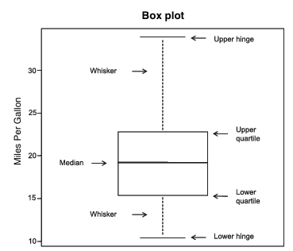

```{r setup, include=FALSE}
knitr::opts_chunk$set(echo = TRUE)
```
### Bar Chart
1. Bar charts display the distribution of categorical variables through vertical
or horizontal bars. Function **barplot()** can do this. Its prototype here.
```r
barplot(height)
```
The above parameter, height is a vector or a matrix.  
This time, we ought to use a data set about the outcome of a study investigating 
a new treatment for rheumatoid arthritis(類風濕關節炎 in Chinese). This data set is contained in package **vcd**, which is also needed when knitting *spinogram*.

#### Simple Bar Chart
2. In bar plot function **barplot(height)**, if *height* is a vector, then its values
decide the height of each bar and plot a vertical bar chart. Parameter `horiz = TRUE`
can make it horizontal. Here is an example.
```{r, include = TRUE, fig.align = "center"}
# Import package vcd to use its data set Arthritis
library(vcd)
# Function table() transfers the variable to a table
counts <- table(Arthritis$Improved)
counts
barplot(counts, main = "Simple Bar Plot", xlab = "Improvement", ylab = "Frequency")
barplot(counts, main = "Horizontal Bar Plot", xlab = "Frequency", ylab = "Improvement", horiz = TRUE)
```
If the plotting variable is a factor, we can just use function **plot()** to plot
it as the same style.

#### Stacked and Grouped Bar Chart
3. In bar plot function **barplot(height)**, if *height* is a matrix, then the plotting
result will be a stacked plot or a grouped plot which is decided by parameter *beside*.
If `beside = FALSE`, it is also the default value, then it will be a stacked plot,
if `beside = TRUE`, then it will be a grouped plot. Here is an example.
```{r, include = TRUE, fig.align = "center"}
library(vcd)
counts <- table(Arthritis$Improved, Arthritis$Treatment)
counts
barplot(counts, main = "Stacked Bar Plot", xlab = "Treatment", ylab = "Frequency", col = c("red", "yellow", "green"))
legend("bottomleft", legend = rownames(counts), inset = 0.05, title = "Results", pch = c(15), col = c("red", "yellow", "green"))
barplot(counts, main = "Grouped Bar Plot", xlab = "Treatment", ylab = "Frequency", col = c("red", "yellow", "green"), beside = TRUE)
legend("top", legend = rownames(counts), title = "Results", pch = c(15), col = c("red", "yellow", "green"))
```
#### Mean Bar Chart
Bar plots can also depict mean, median value, standard deviation based bar plots. 
Here is an example.
```{r, include = TRUE, fig.align = "center"}
states <- data.frame(state.region, state.x77)
means <- aggregate(states$Illiteracy, by = list(state.region), FUN = mean)
means
means <- means[order(means$x), ]
means
barplot(means$x, names.arg = means$Group.1)
lines(means$x, lty = 5, lwd = 2)
title("Mean Illiteracy Rate")
```
We can also create mean bar plots with superimposed confidence intervals using 
the **barplot2()** function in the **gplots** package.

#### Tweaking Bar Chart
We have many methods to tweak the bar plots. The parameter **names.arg** allow us
specify a character vector as the label names of bars.
```{r, include = TRUE, fig.align = "center"}
library(vcd)
# Broaden margins, by default mar = (c(5, 4, 4, 2) + 0.1)
par(mar = c(5, 8, 4, 2))
# Make labels perpendicular to axis, by default las = 0
par(las = 2)
counts <- table(Arthritis$Improved)
barplot(counts, main = "Treatment Outcome", horiz = TRUE, cex.names = 0.8, names.arg = c("No Improvement", "Some Improvement", "Marked Improvement"))
```
#### Spinogram
4. Here is a special type bar chart, spinogram. This chart makes all bars' height
equal to 1, each sector's height represents its proportion. We can use function
**spine()** in package **vcd** to paint it. Here is an example.
```{r, include = TRUE, fig.align = "center"}
library(vcd)
attach(Arthritis)
  counts <- table(Treatment, Improved)
  spine(counts, main = "Spinogram Example")
detach(Arthritis)
```
### Pie Chart
5. Pie charts can be created by function **pie(x, labels)**. Here, *x* is a 
non-negative vector represents acreage of each sector, *labels* is a character 
vector represents each sector's label. Here is an example.
```{r, include = TRUE, fig.align = "center"}
par(mfrow = c(2, 2))
slices <- c(10, 12, 4, 16, 8)
lbls <- c("US", "UK", "Australia", "Germany", "France")
pie(slices, labels = lbls, main = "Simple Pie Chart")
pct <- round(slices / sum(slices) * 100)
# paste(x, y, z, sep = "") = xyz
lbls2 <- paste(lbls, " ", pct, "%", sep = "")
pie(slices, labels = lbls2, col = rainbow(length(lbls2)), main = "Pie Chart with Percentages")
library(plotrix)
pie3D(slices, labels = lbls, explode = 0.1, main = "3D Pie Chart")
mytable <- table(state.region)
lbls3 <- paste(names(mytable), "\n", mytable, sep = "")
pie(mytable, labels = lbls3, main = "Pie Chart from a Table\n (with sample sizes)")
```
6. The above code, function **pie3D()** comes from package **plotrix**, its format
is **plotrix(x, labels)**, same as the function **pie()**. The parameter **explode**
here is used to represent the amount to "explode" the pie in user units.
7. We also have another graph type, fan chart. We can use function **fan.plot()**
in package **plotrix** to plot it. Here is an example.
```{r, include = TRUE, fig.align = "center"}
library(plotrix)
slices <- c(10, 12, 4, 16, 8)
lbls <- c("US", "UK", "Australia", "Germany", "France")
fan.plot(slices, labels = lbls, main = "Fan Plot")
```
In fan charts, the radius-es are different for convenience, and the width of each
sector represents the value.

### Histogram
8. Histogram is used to display the distribution of continuous variables. Its x
axis is divided to some groups, y value of each group represents the frequency of 
each group. We can use function **hist(x)** to create a histogram. The parameter
*x* is a numeric vector formed by numbers. `freq = FALSE` represents plotting the
graph according to probability density but not frequency number. Parameter **breaks**
can control the number of groups, when dividing, equally spaced breaks are the default.
Here is an example.
```{r, include = TRUE, fig.align = "center"}
par(mfrow = c(2, 2))
hist(mtcars$mpg)
hist(mtcars$mpg, breaks = 12, col = "red", xlab = "Miles per Gallon", main = "Colored histogram with 12 bins")
hist(mtcars$mpg, freq = FALSE, breaks = 12, col = "red", xlab = "Miles per Gallon", main = "Histogram, rug plot, density curve")
rug(jitter(mtcars$mpg))
lines(density(mtcars$mpg), col = "blue", lwd = 2)
x <- mtcars$mpg
h <- hist(x, breaks = 12, col = "red", xlab = "Miles per Gllon", main = "Histogram with normal curve and box")
xfit <- seq(min(x), max(x), length = 40)
yfit <- dnorm(xfit, mean = mean(x), sd = sd(x))
yfit <- yfit * diff(h$mids[1 : 2]) * length(x)
lines(xfit, yfit, col = "blue", lwd = 2)
box()
```
The first graph is the default type. The second graph has 12 groups specified in
`breaks = 12`, and we specify its color. The third graph adds a density line and 
rug plot. The density plot will be introduced later, the rug plot is a one-dimensional representation of the actual data values. If there are ties(Appear same values, called
tie), we can also jitter the data using this method: `rug(jitter(mtcars$mpag, amount = 0.01))`. So we will add a small random value to each data point(a uniform random variate between ±amount), in order to avoid overlapping points.

9. Function **jitter(x, amount = n)** can add a random variate to numeric vector x,
the `amount` is the range.
10. Function **box()** can add a frame when plotting.

### Kernel Density Chart
10. Kernel density estimation is a nonparametric method for estimating the probability
density function. To plot a kernel density function(not superimposed on another graph),
we can use function **plot(density(x))**. The parameter *x* is a numeric vector. The
kernel density function will plot the density of different values of x. Here is an example.
```{r, include = TRUE, fig.align = "center"}
par(mfrow = c(2, 1))
d <- density(mtcars$mpg)
plot(d)
plot(d, main = "Kernel Density of Miles per Gallon")
polygon(d, col = "red", border = "blue")
rug(mtcars$mpg, col = "brown")
```
11. The above code, function **polygon(x, y, col = "value", border = "value")** 
can plot polygons whose vertexes are defined by *x* and *y*.
12. We can superimpose more kernel density functions to the graph using the function
**sm.density.compare(x, factor)** in package **sm**. The parameter *x* is a numeric
vector, *factor* is a grouping variable. Here is an example.
```{r, include = TRUE, fig.align = "center"}
library(sm)
attach(mtcars)
  cyl.f <- factor(cyl, levels = c(4, 6, 8), labels = c("4 cylinder", "6 cylinder", "8 cylinder"))
  sm.density.compare(mpg, cyl, xlab = "Miles per Gallon")
  title(main = "MPG Distribution by Car Cylinders")
  colfill <- c(2 : (1 + length(levels(cyl.f)))) 
  legend("topright", inset = 0.05, levels(cyl.f), fill = colfill)
detach(mtcars)
```
Again, function `sm.density.compare(x, group, ...)`, *x* is a vector of data, *group*
is a vector of group labels. If this is not already a factor it will be converted 
to a factor.

### Box Chart
13. Box plot describes the distribution of continuous variables by plotting five
numbers of it: minimum, lower quantile(25%), median, upper quantile(75%), maximum.
It will display outliers which is outside the range of ±1.5 * IQR, where IQR = upper
quantile - lower quantile. Use function **boxplot(x, ...)** to plot box chart. The
parameter, *x* is the data. Here is a chart.
```{r, echo = FALSE, out.width = "70%", fig.align = "center", fig.cap = "A box plot example with annotations"}

```
The above chart, the whiskers will not exceed 1.5 times the interquartile range 
for the box, points outside this range will be plotted as dots.
14. Additionally, we can use function **boxplot.stats(x)** to output the key values
including five numbers of data x.
15. Moreover, box plot can also display grouped variables. Use function **boxplot(formula, data = dataframe)**, the parameter, *formula* is a formula, *dataframe* is a data 
frame or a list. The format of *formula* is `y ~ A`, where y is the displaying value,
and A is the grouped key. `y ~ A * B` will generate a box chart about y values based
on each unique combination of A and B. Add parameter `varwidth = TRUE` will make 
the box plot widths proportional to the square root of their sample size. Add 
`horizontal = TRUE` can reverse the axis orientation. Here is an example.
```{r, include = TRUE, fig.align = "center"}
attach(mtcars)
  boxplot(mpg ~ cyl, data = mtcars, main = "Car Mileage Data", xlab = "Number of Cylinders", ylab = "Miles per Gallon")
detach(mtcars)
```
16. We can add a parameter `notch = TRUE` to plot box charts containing notch. Here 
is an example.
```{r, include = TRUE, fig.align = "center"}
attach(mtcars)
  boxplot(mpg ~ cyl, data = mtcars, notch = TRUE, varwidth = TRUE, col = "red", main = "Car Mileage Data", xlab = "Number of Cylinders", ylab = "Miles per Gallon")
detach(mtcars)
```
Lastly, we can plot box plots for multiple grouped factors. Here is an example.
```{r, include = TRUE, fig.align = "center"}
attach(mtcars)
  mtcars$cyl.f <- factor(mtcars$cyl, levels = c(4, 6, 8), labels = c("4", "6", "8"))
  mtcars$am.f <- factor(mtcars$am, levels = c(0, 1), labels = c("auto", "standard"))
  boxplot(mpg ~ am.f * cyl.f, data = mtcars, varwidth = TRUE, col = c("gold", "darkgreen"), main = "MPG Distribution by Auto Type", xlab = "Auto Type", ylab = "Miles per Gallon")
detach(mtcars)
```
#### Violin Chart
17. Violin Chart is a variant of box plot, it combines box plot and kernel density 
plot. We can plot it using function **vioplot()** in package **vioplot**. Its format
here.
```r
vioplot(x1, x2, ..., names = , col = )
```
The above parameters, *x1* and *x2* are numeric vectors to be plotted(every vector will have a violin plot). *names* is a character vector of labels in violin plot, *col*
is a color vector containing color for each violin plot, Here is an example.
```{r, include = TRUE, fig.align = "center"}
library(vioplot)
attach(mtcars)
  # In violin plot, we need to separate each group
  x1 <- mtcars$mpg[mtcars$cyl == 4]
  x2 <- mtcars$mpg[mtcars$cyl == 6]
  x3 <- mtcars$mpg[mtcars$cyl == 8]
  vioplot(x1, x2, x3, names = c("4 cyl", "6 cyl", "8 cyl"), col = "gold")
  title("Violin Plots of Miles per Gallon", ylab = "Miles per Gallon", xlab = "Number of Cylinders")
detach(mtcars)
```
The above charts, white points are median values, black box ranges are from lower
quantile to upper quantile, black thin lines are whiskers. The outer shapes are 
mirrored kernel density plots.

### Dot Chart
18. Dot chart can display many dots with labels in a graph, we can use function 
**dotchart()** to plot it. Its format below.
```
dotchart(x, labels = )
```
The above parameters, *x* is a numeric vector, *labels* is a vector formed by 
each dot's label. We can add a parameter **groups** to specify a factor to group 
elements in *x*. If this is the case, parameter **gcolor** can control the colors 
of different groups, **cex** can control the size of the labels. Here is an example.
```{r, include = TRUE, fig.align = "center"}
dotchart(mtcars$mpg, labels = row.names(mtcars), cex = .7, main = "Gas Mileage for Car Models", xlab = "Miles per Gallon")
```
Usually, dot charts are useful when ordered, colored, grouped. Here is an example.
```{r, include = TRUE, fig.align = "center"}
attach(mtcars)
  # Order the cars by mpg ascending
  x <- mtcars[order(mpg), ]
  x$cyl <- factor(x$cyl)
  # Define a character vector named color into x
  x$color[x$cyl == 4] <- "red"
  x$color[x$cyl == 6] <- "blue"
  x$color[x$cyl == 8] <- "darkgreen"
  # Group the data by different cyl values, grouped labels' colors are defined by gcolor, and dots', labels' colors are defined by color
  # Grouped
  dotchart(x$mpg, labels = row.names(x), cex = .7, groups = x$cyl, gcolor = "black", color = x$color, pch = 19, main = "Gas Mileage for Car Models\ngrouped by cylinder", xlab = "Miles per Gallon")
  # Not grouped
  dotchart(x$mpg, labels = row.names(x), cex = .7, color = x$color, pch = 19, main = "Gas Mileage for Car Models\nnot grouped", xlab = "Miles per Gallon")
detach(mtcars)
```
Dot chart is not practical when dots increase.